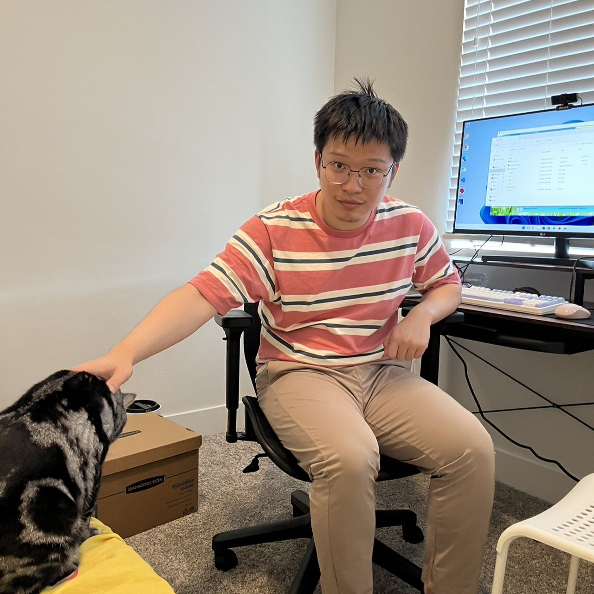

### Welcome to My Home Page!
I am Ziheng Liu, a Ph.D. student at the School of Computer Science, College of Computing, Georgia Institute of Technology.

### My Research
I am advised by Professor Jun Xu.
My current research topic is coding theory's application in networks and databases.

### Publications
- Gong, L., Liu, Z., Liu, L., Xu, J., Ogihara, M., & Yang, T. (2020). [<em>Space-and computationally-efficient set reconciliation via parity bitmap sketch (PBS)</em>](http://vldb.org/pvldb/vol14/p458-gong.pdf). Proceedings of the VLDB Endowment, 14(4), 458-470.
- Li, D., Du, R., Liu, Z., Yang, T., & Cui, B. (2019, April). [<em>Multi-copy cuckoo hashing</em>](https://www.researchgate.net/profile/Dagang-Li-2/publication/333320343_Multi-copy_Cuckoo_Hashing/links/5cf72569a6fdcc8475063d18/Multi-copy-Cuckoo-Hashing.pdf). In 2019 IEEE 35th International Conference on Data Engineering (ICDE) (pp. 1226-1237). IEEE.

### Contact Me
Email: zliu(3 * 4 * 5 * 13) at gatech dot edu ([Need a calculator?](https://www.google.com/search?q=3*4*5*13))  
Office: 3337 Klaus Advanced Computing Building, GaTech

### About Me
I grew up in Shanghai, China, and received my Bachelor's Degree from Peking University in 2020.
I started to pursue my Ph.D. Degree at Georgia Tech in 2021, delayed by COVID-19 pandemic.

